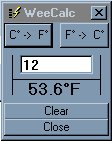



## WeeCalc

### Description

This code I put together to convert celcius to farenheit or vice versa and to show to do simple calculations within a certain set of paramaters. I believe the code to be very well documented. I dont beleive anyone will have any trouble in figuring out what i did on this..
 
### More Info
 

             |
---                |---
**Submitted On**   |2001-03-17 09:18:14
**By**             |[NULL](https://github.com/Planet-Source-Code/PSCIndex/blob/master/ByAuthor/empty.md)
**Level**          |Beginner
**User Rating**    |4.5 (27 globes from 6 users)
**Compatibility**  |VB 5\.0, VB 6\.0
**Category**       |[Complete Applications](https://github.com/Planet-Source-Code/PSCIndex/blob/master/ByCategory/complete-applications__1-27.md)
**World**          |[Visual Basic](https://github.com/Planet-Source-Code/PSCIndex/blob/master/ByWorld/visual-basic.md)
**Archive File**   |[CODE\_UPLOAD171903172001\.zip](https://github.com/Planet-Source-Code/weecalc__1-21715/archive/master.zip)

